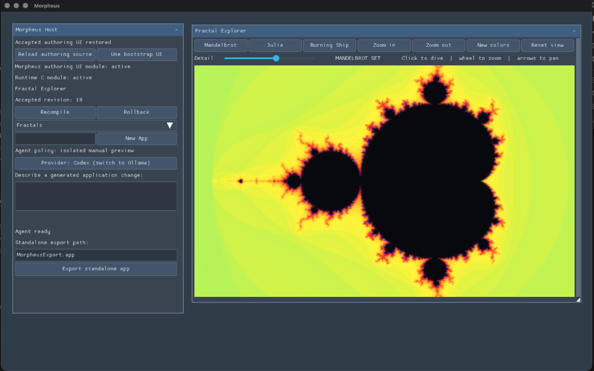

# Morpheus

Morpheus is an experimental native application builder in which a coding agent
creates and revises a C application while Morpheus remains running as its host.
Generated source is compiled in memory with TinyCC, validated against a stable
host ABI, and presented as a live preview. The user can accept the candidate as
a durable revision, reject it, or roll back to an earlier revision.

The ultimate goal is to make Morpheus the factory, not a runtime requirement:
an accepted application should export as a conventional, relocatable,
self-contained executable that can run and persist its own state without the
Morpheus checkout, TinyCC, an agent, or development tools.

Morpheus is currently an early macOS prototype. The native shell uses SDL3,
Nuklear, Metal, Objective-C, and C, while the builder interface itself is a
replaceable `morph_app_api` module written in C. The architecture is intended
to support other platforms and Nuklear rendering backends later, but those
ports do not exist yet.



## What works today

- Minimal native SDL3 shell with a replaceable, self-hosted Nuklear builder UI
- Versioned capability tables separating presentation from authoring providers
- Metal renderer with three reusable frame slots, growable vertex/index
  buffers, 32-bit draw indices, and cached texture/scissor bindings
- In-memory compilation and transactional hot reload through TinyCC
- ABI validation, state capture/migration, failed-build recovery, and rollback
- Named application workspaces under `projects/`
- Agent-driven edit, compiler-repair, preview, accept, and reject workflow
- Codex and Ollama provider adapters behind a provider-neutral file protocol
- Asynchronous native HTTP on macOS through `NSURLSession`
- Opaque `morph_json_*` parsing and serialization backed by yyjson
- Host-owned PNG/JPEG loading from memory or HTTP/HTTPS URLs
- Revision history, crash-session tracking, and durable agent artifacts
- Ahead-of-time frozen `.app` export with assets, a manifest, persistent state,
  and an ad-hoc hardened-runtime signature
- Static third-party linkage in exported apps; only operating-system libraries
  and macOS frameworks remain dynamically linked
- Generated-module runtime hardening through an explicit libc allowlist and an
  optional `stb_leakcheck` allocation diagnostic

SQLite and miniz are pinned, built, and tested as host dependencies, but stable
generated-app persistence and compression facades are not implemented yet.
The llama.cpp submodule is also pinned for the planned local model service but
is not part of the current host executable.

## Intended workflow

1. Start Morpheus and create or select an application.
2. Describe a change to the selected coding-agent provider.
3. Morpheus gives the provider an isolated candidate source file.
4. The candidate is compiled without replacing the accepted source.
5. Build or activation diagnostics can drive up to three repair attempts.
6. A valid, changed candidate becomes a live preview.
7. Accepting writes the source and creates a revision checkpoint; rejecting
   restores the previous module and state.
8. Export the accepted application as a standalone macOS bundle.

Generated C source is the durable source of truth. Relocated TinyCC memory is
never treated as a distributable artifact.

## Architecture

Morpheus now separates the platform shell, authoring presentation, development
providers, generated client, and frozen runtime:

```text
macOS shell (SDL, input, Nuklear context, Metal, recovery)
  |
  +-> authoring UI module (`morph_app_api`)
  |     |
  |     +-> public controller/projects/revisions/modules/agent/export tables
  |
  +-> generated client preview (runtime services only)

user request -> isolated agent -> candidate.c -> TinyCC -> live preview
                                                   |
                                                   +-> accept/reject
accepted app.c ------------------------------------+-> Clang -> frozen .app
```

The native shell in `src/host/main.m` is the composition root. It owns the event
loop, window, one Nuklear context and Metal renderer, constructs native services,
registers development capabilities, and enforces immutable bootstrap and
recovery policy. It does not implement builder widgets or multi-provider
workflow logic.

The builder presentation in `src/authoring/morpheus_app.c` compiles into
`libmorpheus_authoring_ui.a` and implements the same application lifecycle as a
generated app. It uses only public headers and discovers projects, revisions,
module compilation, coding-agent, export, and controller services through
versioned capability tables. The controller executes cross-provider operations
at frame boundaries. The UI can be compiled with TinyCC, previewed, accepted,
rolled back, and restored after a clean launch; an ahead-of-time copy remains
the known-good bootstrap.

Development provider implementations live in `libmorpheus_authoring.a` and do
not depend on the UI archive. Generated client previews receive a separate base
host containing HTTP, JSON, image, logging, and rendering access, but no
authoring capability registry. Frozen exports omit both authoring archives,
TinyCC, and agent support.

`libmorpheus_runtime_core.a` contains shared HTTP, JSON, and image services.
`libmorpheus_standalone_runtime.a` owns the standalone SDL/Nuklear/Metal
lifecycle and persistent-state envelope used by frozen applications. The frozen
`src/export/main.m` is only a metadata and generated-entry-point adapter.

Generated code owns application behavior, UI composition, and serializable
domain state. It reaches host services through versioned `morph_*` facades and
opaque handles rather than retaining platform service objects.

### Rendering boundary

Nuklear remains the portable UI boundary. The CPU builds a command stream and
`nk_convert` writes packed vertices and 32-bit indices directly into shared
Metal buffers. The renderer rotates through three frame slots, grows buffers on
demand up to configured caps, and avoids redundant texture and scissor state
changes while encoding indexed draws. Generated modules never receive Metal
objects or command encoders, so another host can retain the same module ABI and
provide a different Nuklear backend.

Every module exports:

```c
const morph_app_api *morph_app_entry(void);
```

The authoritative ABI and SDK declarations are in
[`include/morpheus/app_api.h`](include/morpheus/app_api.h) and
[`include/morpheus/sdk.h`](include/morpheus/sdk.h). The current ABI version is
3. A module supplies create, destroy, update, render, save-state, and load-state
callbacks. It may render inside the host's generated-application panel or opt
into managing its own Nuklear windows with `MORPHEUS_RENDER_NUKLEAR_WINDOWS`.

Generated modules are compiled as freestanding C with `-nostdlib -Wall
-Werror`. Morpheus explicitly exposes the enabled Nuklear symbols and a bounded
libc subset. Unbounded destination-writing functions such as `strcpy` are not
available; bounded `strncpy` and `snprintf` remain available. Modules do not
receive direct SDL, Metal, filesystem, or native networking access.

Development builds can track allocations made directly by TinyCC-generated
modules with `-DMORPHEUS_ENABLE_RUNTIME_LEAKCHECK=ON`. This optional diagnostic
uses `stb_leakcheck` and reports surviving allocations when the runtime module
shuts down. It is intended for the single runtime-callback thread; it does not
track host-service allocations and is not a general-purpose sanitizer. It is
disabled by default and is not compiled into frozen exports.

## Repository layout

```text
include/morpheus/  Stable app ABI, runtime SDK, and public authoring tables
src/host/          macOS composition root, native services, and Metal renderer
src/runtime/       Shared standalone lifecycle and persistence implementation
src/authoring/     Replaceable builder UI, controller, providers, and shell
src/compiler/      TinyCC compilation, validation, and hot reload
src/agent/         Provider-neutral agent session protocol
src/project/       Projects, revisions, state, and recovery metadata
src/export/        Minimal ahead-of-time frozen entry-point adapter
tools/             Codex/Ollama adapters and standalone exporter
tests/             Runtime, service, persistence, and agent tests
cmake/             Bundle metadata, entitlements, and export manifest
projects/          Named development workspaces and accepted source
generated/         Legacy/default generated source and assets
docs/              Detailed agent and export documentation
```

A project workspace owns `app.c`, `assets/`, revision checkpoints, state, and
agent runs. Morpheus creates a starter project if no project exists and records
the active project in `projects/.active-project`.

## Build and run

The current build requires macOS, full Xcode 26 or newer (including Clang and
`actool`), CMake 3.24 or newer, Git, Make, and `patch`. Apple Silicon is the
actively developed target. The build compiles the layered Icon Composer source
at `docs/icons/morpheus.icon` into modern and backward-compatible bundle
resources.

Initialize the pinned dependencies after cloning:

```sh
git submodule update --init --recursive
```

Configure and build:

```sh
cmake -S . -B build -DCMAKE_BUILD_TYPE=Debug
cmake --build build --parallel
open build/Morpheus.app
```

The default Codex adapter expects the CLI bundled with ChatGPT at
`/Applications/ChatGPT.app/Contents/Resources/codex`. Override that location
with `MORPHEUS_CODEX_EXECUTABLE`. The user must already be authenticated for
the selected provider.

For Ollama, start a local Ollama server and install a coding-capable model. The
adapter currently uses the system `curl` and `jq` executables to communicate
with Ollama; they are development-provider requirements and are not linked into
Morpheus or a frozen export.

```sh
MORPHEUS_AGENT_BACKEND=ollama \
MORPHEUS_OLLAMA_MODEL=your-model \
build/Morpheus.app/Contents/MacOS/Morpheus
```

Provider configuration and protocol details are documented in
[`docs/agent-provider-protocol.md`](docs/agent-provider-protocol.md).

Morpheus boots its own builder UI from a known-good AOT module. The recovery
controls can compile the checked-out authoring source as a live preview, accept
it durably, or return to the bootstrap. Accepted authoring source is restored on
the next clean launch. If the previous authoring session exited abnormally,
Morpheus stays on the bootstrap automatically. Set `MORPHEUS_SAFE_MODE=1` to
force that recovery path explicitly. See
[`docs/self-hosting.md`](docs/self-hosting.md) for the lifecycle, trust
boundary, recovery files, and development overrides.

## Tests and hardened development build

Run the complete test suite with:

```sh
ctest --test-dir build --output-on-failure
```

The current macOS configuration registers 23 default tests covering capability
boundaries, authoring UI/provider separation, transactional reload and recovery,
agent artifact isolation, runtime services, frozen-export isolation, and pinned
dependencies. Some service tests open a loopback HTTP socket. The image test
may skip when no Metal device is available. Enabling
`MORPHEUS_ENABLE_RUNTIME_LEAKCHECK` adds its allocation-accounting test. To apply
and verify the development hardened-runtime signature and JIT entitlement:

```sh
cmake --build build --target morpheus_hardened
```

TinyCC uses a repository patch for Apple Silicon `MAP_JIT` behavior. A working
development build is not, by itself, proof that an application is ready for
Developer ID signing, notarization, and Gatekeeper distribution.

## Export a standalone app

The exporter uses the active project's accepted `app.c` by default:

```sh
tools/morpheus-export /path/to/MyApp.app
```

A specific accepted revision can be supplied as the second argument:

```sh
tools/morpheus-export \
  /path/to/MyApp.app \
  projects/my-app/revisions/00000004/app.c
```

Configure bundle metadata through environment variables:

```sh
MORPHEUS_EXPORT_NAME="My App" \
MORPHEUS_EXPORT_BUNDLE_ID="com.example.my-app" \
MORPHEUS_EXPORT_VERSION="1.0.0" \
tools/morpheus-export /path/to/MyApp.app
```

The exporter refuses to overwrite an existing destination. It performs a
separate Clang build with dead-code elimination, strips local/debug symbols,
copies assets and a versioned manifest, and ad-hoc signs the resulting bundle.
The frozen profile omits TinyCC, agents, llama.cpp, revision controls, and the
development UI. Runtime state is written atomically to
`~/Library/Application Support/<bundle-id>/state.bin` rather than into the
signed bundle.

Developer ID signing, notarization, stapling, archive/installer creation, and
clean-machine validation remain the distributor's responsibility. See
[`docs/standalone-export.md`](docs/standalone-export.md) for details.

## Security and trust boundaries

Generated modules execute in the Morpheus process and therefore must currently
be treated as trusted native code. Compilation and ABI validation protect the
reload lifecycle; they are not a security boundary. Isolated execution of
untrusted previews is a planned feature.

The macOS Codex adapter runs in a per-request directory with a Codex permission
profile that gives model-generated commands minimal platform reads, read access
to the run directory, and write access only to `candidate.c`. Command network
access, ambient user configuration and rules, plugins, apps, hooks, web search,
and inherited shell environment values are disabled. Codex itself retains
access to its authentication state. Morpheus validates a cryptographic manifest
of provider artifacts after every attempt before compiling the candidate.

Agent run directories retain prompts, responses, diagnostics, candidates, and
patches for reproducibility. Do not put API keys or other secrets in prompts or
generated source: those values can be stored in project history and may be
compiled into exports. Secret storage and export-time credential scanning are
not complete.

HTTP and image services are bounded. The current HTTP facade limits response
bodies to 1 MiB. Images may be loaded from encoded memory, asynchronously from
URLs, or synchronously from tightly packed generated RGBA8 pixels. Inputs are
limited to 1 MiB encoded, 4096 pixels per dimension, 16 megapixels decoded, and
64 live image jobs per host. Procedural applications should cache one uploaded
image instead of rebuilding large grids of Nuklear primitives every frame.

## Dependencies and licensing

Dependencies are pinned as Git submodules so builds do not download packages at
runtime and third-party libraries can be linked statically. Current licenses
include:

| Dependency | Purpose | License |
| --- | --- | --- |
| SDL3 | Window and input portability | zlib |
| Nuklear | Immediate-mode UI | Public domain or MIT |
| TinyCC | Development-time in-memory C compiler | LGPL-2.1 |
| SQLite | Persistence foundation | Public domain |
| yyjson | JSON implementation | MIT |
| miniz | Compression foundation | MIT |
| stb | Image decoding | Public domain or MIT |
| llama.cpp | Planned local model service | MIT |

The default frozen profile does not include TinyCC or llama.cpp. It statically
links its included third-party runtime code and dynamically links only macOS
system libraries/frameworks such as Foundation, Metal, and QuartzCore.

Review each dependency's included license before redistribution. Morpheus's
original code is available under the [MIT License](LICENSE); bundled and
submodule dependencies remain governed by their respective licenses.

## Project status and roadmap

This repository is a development prototype, not a production application SDK.
The host/UI and frozen-runtime separation milestones are complete for the
current macOS workflow. Important remaining work includes versioned
persistence/compression facades, process-isolated generated preview execution,
secret handling, a host-owned llama.cpp service, cross-platform hosts/renderers,
robust state migrations, broader clean-machine export validation, and a complete
Developer ID signing/notarization workflow.

The detailed design, milestones, and acceptance criteria live in
[`plan.md`](plan.md). When README behavior and implementation differ, the code
and tests describe the current behavior; the plan describes the intended
direction.
