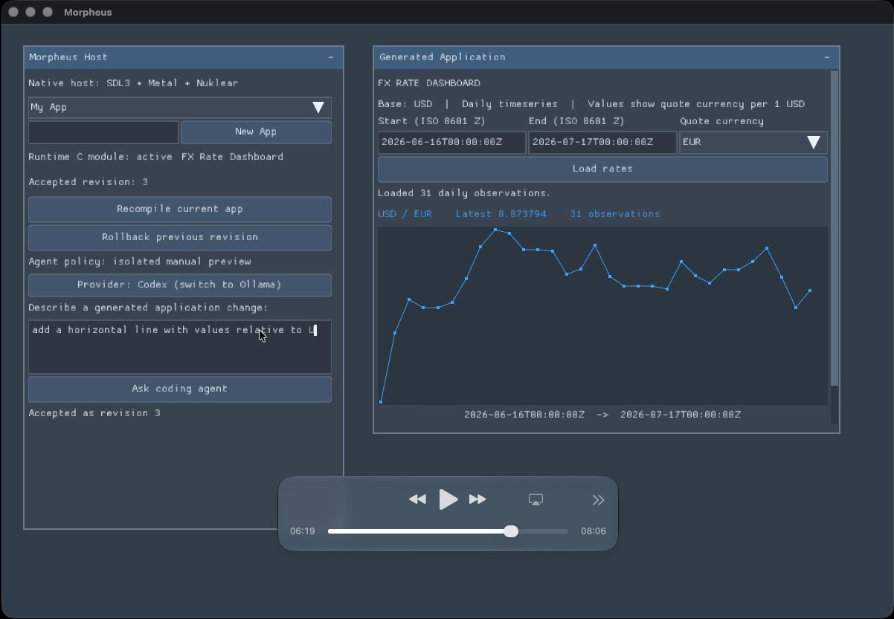

# Morpheus

Morpheus is an experimental native application builder in which a coding agent
creates and revises a C application while Morpheus remains running as its host.
Generated source is compiled in memory with TinyCC, validated against a stable
host ABI, and presented as a live preview. The user can accept the candidate as
a durable revision, reject it, or roll back to an earlier revision.

The ultimate goal is to make Morpheus the factory, not a runtime requirement:
an accepted application should export as a conventional, relocatable,
self-contained executable that can run and persist its own state without the
Morpheus checkout, TinyCC, an agent, or development tools.

Morpheus is currently an early macOS prototype. The implemented host uses SDL3,
Nuklear, Metal, Objective-C, and C. The architecture is intended to support
other platforms and Nuklear rendering backends later, but those ports do not
exist yet.



## What works today

- Native SDL3/Metal host with a Nuklear immediate-mode interface
- In-memory compilation and transactional hot reload through TinyCC
- ABI validation, state capture/migration, failed-build recovery, and rollback
- Named application workspaces under `projects/`
- Agent-driven edit, compiler-repair, preview, accept, and reject workflow
- Codex and Ollama provider adapters behind a provider-neutral file protocol
- Asynchronous native HTTP on macOS through `NSURLSession`
- Opaque `morph_json_*` parsing and serialization backed by yyjson
- Host-owned PNG/JPEG loading from memory or HTTP/HTTPS URLs
- Revision history, crash-session tracking, and durable agent artifacts
- Ahead-of-time frozen `.app` export with assets, a manifest, persistent state,
  and an ad-hoc hardened-runtime signature
- Static third-party linkage in exported apps; only operating-system libraries
  and macOS frameworks remain dynamically linked

SQLite and miniz are pinned, built, and tested as host dependencies, but stable
generated-app persistence and compression facades are not implemented yet.
The llama.cpp submodule is also pinned for the planned local model service but
is not part of the current host executable.

## Intended workflow

1. Start Morpheus and create or select an application.
2. Describe a change to the selected coding-agent provider.
3. Morpheus gives the provider an isolated candidate source file.
4. The candidate is compiled without replacing the accepted source.
5. Build or activation diagnostics can drive up to three repair attempts.
6. A valid, changed candidate becomes a live preview.
7. Accepting writes the source and creates a revision checkpoint; rejecting
   restores the previous module and state.
8. Export the accepted application as a standalone macOS bundle.

Generated C source is the durable source of truth. Relocated TinyCC memory is
never treated as a distributable artifact.

## Architecture

Morpheus separates a stable native host from a replaceable application module:

```text
user request -> agent -> candidate.c -> TinyCC -> validation -> live preview
                                      |                       |
                                      |                       +-> accept/reject
                                      +-> Clang frozen build -> standalone .app
```

The host owns the event loop, window, Metal renderer, Nuklear context, compiler,
network operations, images, project history, and recovery. Generated code owns
application behavior, UI composition, and serializable domain state. It reaches
host services through versioned `morph_*` facades and opaque handles rather than
retaining third-party or platform objects.

Every module exports:

```c
const morph_app_api *morph_app_entry(void);
```

The authoritative ABI and SDK declarations are in
[`include/morpheus/app_api.h`](include/morpheus/app_api.h) and
[`include/morpheus/sdk.h`](include/morpheus/sdk.h). The current ABI version is
3. A module supplies create, destroy, update, render, save-state, and load-state
callbacks. It may render inside the host's generated-application panel or opt
into managing its own Nuklear windows with `MORPHEUS_RENDER_NUKLEAR_WINDOWS`.

Generated modules are compiled as freestanding C with `-nostdlib -Wall
-Werror`. Morpheus explicitly exposes the enabled Nuklear symbols and a bounded
libc subset. Modules do not receive direct SDL, Metal, filesystem, or native
networking access.

## Repository layout

```text
include/morpheus/  Stable generated-module ABI and SDK
src/host/          macOS host services and main UI
src/compiler/      TinyCC compilation, validation, and hot reload
src/agent/         Provider-neutral agent session protocol
src/project/       Projects, revisions, state, and recovery metadata
src/export/        Minimal ahead-of-time frozen host
tools/             Codex/Ollama adapters and standalone exporter
tests/             Runtime, service, persistence, and agent tests
cmake/             Bundle metadata, entitlements, and export manifest
projects/          Named development workspaces and accepted source
generated/         Legacy/default generated source and assets
docs/              Detailed agent and export documentation
```

A project workspace owns `app.c`, `assets/`, revision checkpoints, state, and
agent runs. Morpheus creates a starter project if no project exists and records
the active project in `projects/.active-project`.

## Build and run

The current build requires macOS, full Xcode 26 or newer (including Clang and
`actool`), CMake 3.24 or newer, Git, Make, and `patch`. Apple Silicon is the
actively developed target. The build compiles the layered Icon Composer source
at `docs/icons/morpheus.icon` into modern and backward-compatible bundle
resources.

Initialize the pinned dependencies after cloning:

```sh
git submodule update --init --recursive
```

Configure and build:

```sh
cmake -S . -B build -DCMAKE_BUILD_TYPE=Debug
cmake --build build --parallel
open build/Morpheus.app
```

The default Codex adapter expects the CLI bundled with ChatGPT at
`/Applications/ChatGPT.app/Contents/Resources/codex`. Override that location
with `MORPHEUS_CODEX_EXECUTABLE`. The user must already be authenticated for
the selected provider.

For Ollama, start a local Ollama server and install a coding-capable model. The
adapter currently uses the system `curl` and `jq` executables to communicate
with Ollama; they are development-provider requirements and are not linked into
Morpheus or a frozen export.

```sh
MORPHEUS_AGENT_BACKEND=ollama \
MORPHEUS_OLLAMA_MODEL=your-model \
build/Morpheus.app/Contents/MacOS/Morpheus
```

Provider configuration and protocol details are documented in
[`docs/agent-provider-protocol.md`](docs/agent-provider-protocol.md).

## Tests and hardened development build

Run the complete test suite with:

```sh
ctest --test-dir build --output-on-failure
```

Some service tests open a loopback HTTP socket. The image test may skip when no
Metal device is available. To apply and verify the development hardened-runtime
signature and JIT entitlement:

```sh
cmake --build build --target morpheus_hardened
```

TinyCC uses a repository patch for Apple Silicon `MAP_JIT` behavior. A working
development build is not, by itself, proof that an application is ready for
Developer ID signing, notarization, and Gatekeeper distribution.

## Export a standalone app

The exporter uses the active project's accepted `app.c` by default:

```sh
tools/morpheus-export /path/to/MyApp.app
```

A specific accepted revision can be supplied as the second argument:

```sh
tools/morpheus-export \
  /path/to/MyApp.app \
  projects/my-app/revisions/00000004/app.c
```

Configure bundle metadata through environment variables:

```sh
MORPHEUS_EXPORT_NAME="My App" \
MORPHEUS_EXPORT_BUNDLE_ID="com.example.my-app" \
MORPHEUS_EXPORT_VERSION="1.0.0" \
tools/morpheus-export /path/to/MyApp.app
```

The exporter refuses to overwrite an existing destination. It performs a
separate Clang build, copies assets and a versioned manifest, and ad-hoc signs
the resulting bundle. The frozen profile omits TinyCC, agents, llama.cpp,
revision controls, and the development UI. Runtime state is written atomically
to `~/Library/Application Support/<bundle-id>/state.bin` rather than into the
signed bundle.

Developer ID signing, notarization, stapling, archive/installer creation, and
clean-machine validation remain the distributor's responsibility. See
[`docs/standalone-export.md`](docs/standalone-export.md) for details.

## Security and trust boundaries

Generated modules execute in the Morpheus process and therefore must currently
be treated as trusted native code. Compilation and ABI validation protect the
reload lifecycle; they are not a security boundary. Isolated execution of
untrusted previews is a planned feature.

The macOS Codex adapter runs in a per-request directory and an outer OS sandbox
denies reads of protected home locations including Photos, iCloud/user Library,
Desktop, Documents, Downloads, and media folders. Codex's own nested command
sandbox is disabled because macOS cannot initialize it inside that outer
sandbox. Provider prompts restrict edits to `candidate.c`, but provider code is
still part of the trusted development environment.

Agent run directories retain prompts, responses, diagnostics, candidates, and
patches for reproducibility. Do not put API keys or other secrets in prompts or
generated source: those values can be stored in project history and may be
compiled into exports. Secret storage and export-time credential scanning are
not complete.

HTTP and image services are asynchronous and bounded. The current HTTP facade
limits response bodies to 1 MiB. Image inputs are limited to 1 MiB encoded,
4096 pixels per dimension, 16 megapixels decoded, and 64 live image jobs per
host.

## Dependencies and licensing

Dependencies are pinned as Git submodules so builds do not download packages at
runtime and third-party libraries can be linked statically. Current licenses
include:

| Dependency | Purpose | License |
| --- | --- | --- |
| SDL3 | Window and input portability | zlib |
| Nuklear | Immediate-mode UI | Public domain or MIT |
| TinyCC | Development-time in-memory C compiler | LGPL-2.1 |
| SQLite | Persistence foundation | Public domain |
| yyjson | JSON implementation | MIT |
| miniz | Compression foundation | MIT |
| stb | Image decoding | Public domain or MIT |
| llama.cpp | Planned local model service | MIT |

The default frozen profile does not include TinyCC or llama.cpp. It statically
links its included third-party runtime code and dynamically links only macOS
system libraries/frameworks such as Foundation, Metal, and QuartzCore.

Review each dependency's included license before redistribution. Morpheus's
original code is available under the [MIT License](LICENSE); bundled and
submodule dependencies remain governed by their respective licenses.

## Project status and roadmap

This repository is a development prototype, not a production application SDK.
Important remaining work includes versioned persistence/compression facades,
isolated preview execution, secret handling, a host-owned llama.cpp service,
cross-platform hosts/renderers, robust state migrations, export clean-room
validation, and a complete signing/notarization workflow.

The detailed design, milestones, and acceptance criteria live in
[`plan.md`](plan.md). When README behavior and implementation differ, the code
and tests describe the current behavior; the plan describes the intended
direction.
