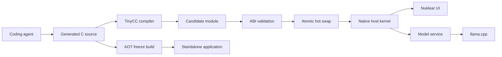

# Morpheus Development Plan

## Vision

Morpheus is an agentic application-development platform built as a small native
"seed" application. A coding agent evolves the application by generating C
source code, which TinyCC compiles and loads into the running process. Nuklear
provides the immediate-mode user interface, while llama.cpp allows local models
to participate alongside an initially supported external coding agent.

Once an application is satisfactory, Morpheus can freeze the accepted source,
assets, configuration, and pinned dependencies into a conventional standalone
executable.

## Ultimate Product Goal

Morpheus is both an application builder and a development host. The intended
end-to-end product workflow is:

1. Launch Morpheus and describe an application.
2. Let an agent create and revise the generated application inside the Morpheus
   host, using hot reload for rapid preview and recovery.
3. Preview, test, accept, and roll back revisions until the application is
   satisfactory.
4. Export the accepted revision as a conventional standalone application.
5. Run and distribute the exported application without requiring Morpheus, the
   Morpheus source checkout, TinyCC, a coding agent, or development tools.
6. Preserve the exported application's user data across launches independently
   of the Morpheus project that created it.

The exported application is the primary user-facing artifact. Morpheus is the
factory used to create it. Continuing self-modification after export is an
optional advanced profile, not a requirement of the default standalone export.

Success therefore means more than producing a Mach-O executable or `.app`
directory. A standalone export must be relocatable, self-contained except for
documented operating-system facilities and optional external services, able to
persist its own state, reproducible from an accepted revision, and suitable for
normal macOS signing and distribution.

## Architectural Principle

The system is divided into two layers:

1. A small, stable native host kernel compiled ahead of time.
2. A replaceable C application module generated by the coding agent.

The host remains responsible for process-level resources and recovery. Generated
code implements application-specific behavior but does not own the event loop,
window, renderer, compiler, or model runtimes. This boundary lets Morpheus reject
failed builds, recover from invalid candidates, preserve state across reloads,
and freeze accepted code through a normal build pipeline.



## Host Kernel Responsibilities

The immutable host kernel owns:

- Window creation, input, events, graphics, and the Nuklear context
- TinyCC compilation and loaded-module lifetimes
- Coding-agent communication and orchestration
- llama.cpp model loading and inference
- Filesystem, networking, logging, and other privileged services
- Generated-source storage, checkpoints, rollback, and history
- Crash reporting and recovery
- Ahead-of-time export and packaging

The host may be implemented internally in C++ so it can integrate llama.cpp
naturally, but it exposes an `extern "C"` interface to generated modules.

## Batteries-Included Application SDK

Generated seed apps should have a small, documented standard library for common
application work without receiving unrestricted access to the host process. The
SDK exposes stable `morph_*` facades while keeping third-party handles,
allocators, threads, and platform details host-owned.

Planned capability tiers:

1. **Async HTTP:** a stable `morph_http_*` facade implemented by the target
   platform's native networking stack where practical, with bounded timeouts,
   cancellation, response limits, headers, status codes, and polling from the
   frame loop. The macOS backend uses `NSURLSession`; Windows should use WinHTTP
   or Schannel-backed curl. A statically linked curl backend remains available
   for platforms whose native stack is unsuitable. No blocking network call may
   run inside `render_ui`.
2. **JSON:** yyjson-backed parsing and serialization with request-scoped or
   arena-owned lifetimes. Generated code should not depend on yyjson internals.
3. **Persistence:** SQLite-backed app storage with a per-application database,
   prepared statements, transactions, and migration helpers.
4. **Compression and assets:** zlib/miniz for cache and bundle compression, plus
   image loading helpers that produce host-managed Nuklear-compatible assets.
5. **Utility layer:** configuration parsing, UUIDs, hashing, bounded buffers,
   regular expressions, and background jobs as demand proves out.

Initial implementation milestones:

- Add `include/morpheus/sdk.h` and versioned capability tables.
- Expose an asynchronous HTTP request/poll API and provide native platform
  backends without dynamically linked third-party libraries.
- Add deterministic seed-app tests for success, timeout, cancellation, and
  response-size limits.
- Add yyjson and a JSON facade after HTTP is stable.
- Add SQLite persistence and revision-safe database ownership.
- Add compression/assets only after the memory and lifetime rules are tested.

Raw library APIs may be available to the host implementation, but generated
modules should use the Morpheus facade. This keeps hot reload safe, makes
capability policy explicit, and lets the host change library versions without
breaking every generated app.

## Generated Module Responsibilities

The replaceable C module owns:

- Application-specific behavior
- UI composition
- Domain data and state
- Agent-created features
- State serialization and migration

Generated modules must not own the main event loop or retain uncontrolled
pointers into host internals. Access to host functionality is provided through a
versioned capability table.

## Stable Module ABI

Every generated module exports one predictable entry point:

```c
const morph_app_api *morph_app_entry(void);
```

An initial ABI can resemble:

```c
typedef struct morph_app_api {
    uint32_t abi_version;
    const char *name;

    bool (*create)(morph_host *host, void **state);
    void (*destroy)(morph_host *host, void *state);

    void (*event)(morph_host *host, void *state,
                  const morph_event *event);

    void (*update)(morph_host *host, void *state, double dt);
    void (*render_ui)(morph_host *host, void *state);

    bool (*save_state)(morph_host *host, void *state,
                       morph_buffer *output);

    bool (*load_state)(morph_host *host, void **state,
                       const void *data, size_t size);
} morph_app_api;
```

The precise ABI will be refined during the first vertical slice. It should use
fixed-width values and opaque handles wherever possible. ABI versions must be
validated before any candidate callback executes.

## Transactional Hot Reload

TinyCC exposes the required in-memory compilation path through
`tcc_compile_string`, `tcc_add_symbol`, `tcc_relocate`, and `tcc_get_symbol`.

A reload follows this sequence:

1. Create a fresh `TCCState` for the candidate.
2. Configure `TCC_OUTPUT_MEMORY` before compilation.
3. Register the supported host ABI with `tcc_add_symbol`.
4. Compile the candidate source.
5. Relocate the candidate with `tcc_relocate`.
6. Retrieve `morph_app_entry` with `tcc_get_symbol`.
7. Validate the ABI descriptor without modifying the active module.
8. Quiesce callbacks at a frame boundary.
9. Serialize the active module's state into a neutral, versioned buffer.
10. Initialize the candidate and migrate the serialized state.
11. Atomically install the candidate only if initialization succeeds.
12. Destroy and retire the previous module after no callbacks can reference it.

If compilation, validation, initialization, or migration fails, the existing
module remains active and the diagnostics are presented to the user and coding
agent.

The `TCCState` owns its relocated executable memory and must remain alive for as
long as the corresponding module can execute. It cannot be deleted immediately
after resolving the entry point.

## Agent Workflow

The coding-agent integration should be provider-neutral. The initial external
coding agent and later llama.cpp-backed agents should conform to the same host
protocol.

The development loop is:

1. The user describes a desired change.
2. The agent edits durable C source and metadata in the project workspace.
3. Morpheus compiles the candidate without replacing the active module.
4. Compiler and ABI diagnostics are returned to the agent.
5. The agent may repair the candidate and retry.
6. A validated candidate is previewed or activated according to user policy.
7. Accepted revisions become named checkpoints that can be rolled back.

Generated source, rather than relocated machine memory, is the durable source of
truth.

## Safety and Recovery

In-process generated C has the same privileges as the host and can corrupt or
terminate it. Morpheus should therefore distinguish between trusted and
untrusted execution modes:

- **Trusted in-process mode:** maximizes immediacy and supports direct hot reload.
- **Isolated preview mode:** evaluates untrusted candidates in a helper process
  before allowing them into the main process.

Additional safeguards should include:

- A narrow host capability table instead of unrestricted symbol exposure
- Compilation and activation timeouts
- Revision checkpoints before activation
- Crash-loop detection and automatic rollback
- Structured logging associated with source revisions
- State serialization before every swap
- An emergency safe mode that starts without loading the latest module

## Window and Rendering Layer

Nuklear provides UI construction and draw commands but does not create a native
window. A platform/window layer is still required.

The recommended initial stack is:

- SDL3 for windows, input, clipboard, and portability
- Metal for the first macOS renderer
- Nuklear for immediate-mode UI

The pinned Nuklear repository already contains an SDL3/Metal demonstration that
can serve as a reference. SDL3 will need to be introduced as an additional
dependency. A native Cocoa/Metal host remains possible, but it would add
Objective-C implementation work and reduce early portability.

## llama.cpp Integration

llama.cpp belongs behind a host-owned model service rather than being exposed
directly to generated code. The service should eventually support:

- Loading and unloading GGUF models
- Model and context configuration
- Streaming token generation
- Cancellation
- Structured tool requests
- Multiple model/provider profiles
- Progress and memory reporting

Generated applications interact with this service through stable host
capabilities. They do not retain llama.cpp pointers or depend on its internal C++
types.

## Freezing and Distribution

Freezing is a reproducible ahead-of-time build, not a snapshot of TinyCC's live
memory. The export pipeline consumes:

- The accepted generated C source
- Application state or seed data selected for inclusion
- Assets and an asset manifest
- Build and feature configuration
- Exact submodule revisions
- The stable host ABI version

The accepted C source is compiled normally with Clang and linked into an
application executable or bundle.

The export pipeline must have a deliberate boundary between immutable inputs
and mutable runtime data:

- The signed application bundle contains executable code, read-only assets,
  export metadata, and optional seed data.
- On macOS, non-code resources belong under `Contents/Resources` and are located
  at runtime through the application bundle rather than build-time absolute
  paths.
- User-modifiable data belongs outside the bundle, under the platform's
  application-support location. For macOS this is normally
  `~/Library/Application Support/<bundle-id>/`.
- Cacheable or reproducible data belongs under the platform cache location and
  must not be treated as durable application state.
- Exported code must not depend on `MORPHEUS_SOURCE_ROOT`, a CMake build
  directory, submodule working trees, or scripts in the Morpheus repository.

Every export records enough metadata to explain and reproduce the artifact:

- Export format version and application state schema version
- Morpheus host and application ABI versions
- Accepted source revision and content hashes
- Application identifier, name, version, and minimum operating-system version
- Enabled SDK capabilities and optional runtime components
- Asset manifest and hashes
- Exact dependency revisions and relevant build configuration

Application state must use an explicit, versioned serialization format. Raw
copies of an in-memory C structure may be useful for an early prototype, but are
not a durable export format because padding, pointer values, compiler layout,
and later source revisions can change. Exported applications need atomic state
writes, migration hooks, and a policy for recovering from an interrupted or
incompatible write.

Two export profiles are planned:

### Frozen Application

- Generated C is linked as ordinary application code.
- TinyCC and coding-agent components are omitted.
- llama.cpp may be retained or removed based on application requirements.
- The result cannot modify itself unless that capability is explicitly retained.
- This is the default and primary standalone export profile.
- The accepted generated module is compiled ahead of time and linked directly
  into an export host that contains only the capabilities selected by the app.
- The exported UI must not expose Morpheus development controls such as agent
  prompts, recompilation, preview acceptance, or revision rollback unless an
  export option explicitly includes them.
- The app creates its writable application-support workspace on first launch,
  optionally initializing it from bundled seed state.
- Runtime changes are saved on meaningful mutations or a bounded debounce, at
  lifecycle boundaries, and before clean shutdown.

### Self-Modifying Application

- TinyCC, the source workspace, and agent integration remain available.
- Hot reload continues to work after packaging.
- Distribution must account for executable-memory and signing requirements.
- Read-only compiler inputs and initial source are bundled as resources, then
  copied into application support before modification; a signed bundle is never
  used as a writable workspace.
- All TinyCC headers, libraries, provider executables, and other runtime inputs
  must be resolved relative to the bundle or application-support workspace,
  never relative to the original build machine.

GGUF models may be bundled as assets or distributed beside the application.
Because they can be very large, embedding them inside the executable itself is
not the default interpretation of "standalone."

### Export Verification

An export is not considered standalone until it passes a clean-room-style
relocatability test:

1. Build the export from a named accepted revision.
2. Copy the `.app` outside both the source checkout and CMake build tree.
3. Launch with a new application-support directory and no Morpheus-specific
   environment variables.
4. Confirm that no runtime path points into the original checkout or build tree.
5. Modify application state, quit normally, relaunch, and verify restoration.
6. Exercise bundled assets, networking, and every selected host capability.
7. Simulate an interrupted state write and verify recovery behavior.
8. Validate the bundle structure, dynamic-library dependencies, code signature,
   hardened-runtime entitlements, and Gatekeeper assessment.
9. For public distribution, sign with Developer ID, notarize, staple the ticket,
   and repeat launch testing from the actual ZIP, disk image, or installer.

Secrets must not be embedded in generated source, seed state, manifests, or the
executable. Export validation should scan for credentials and build-machine
paths and fail with an actionable diagnostic when either is found.

## Apple Silicon and Hardened Runtime Risk

The current development target is ARM64 macOS. The pinned TinyCC revision includes
ARM64 Mach-O support, but its in-memory relocation implementation needs an early
compatibility test on Apple Silicon.

TinyCC currently appears to use executable memory protections without an
Apple-specific `MAP_JIT` path. Apple Silicon enforces write-versus-execute memory
protection, and Hardened Runtime applications require the
`com.apple.security.cs.allow-jit` entitlement for JIT memory. A maintained TinyCC
patch may be required to allocate `MAP_JIT` memory and perform the appropriate
write-protection transitions.

This must be proven before the broader application framework is built. A working
unsigned development build does not by itself establish that the final signed and
notarized application will work.

Relevant Apple documentation:

- [Porting just-in-time compilers to Apple silicon](https://developer.apple.com/documentation/Apple-Silicon/porting-just-in-time-compilers-to-apple-silicon)
- [Hardened Runtime](https://developer.apple.com/documentation/Security/hardened-runtime)
- [Allow execution of JIT-compiled code entitlement](https://developer.apple.com/documentation/bundleresources/entitlements/com.apple.security.cs.allow-jit)

## Build Strategy

CMake is the recommended top-level build system because llama.cpp already uses
it and it can coordinate the mixed C, C++, and Objective-C/Metal portions of the
macOS host.

A likely repository structure is:

```text
morpheus/
├── CMakeLists.txt
├── cmake/
├── include/morpheus/
│   ├── app_api.h
│   ├── host_api.h
│   └── events.h
├── src/
│   ├── host/
│   ├── compiler/
│   ├── agent/
│   ├── models/
│   ├── platform/
│   └── export/
├── generated/
│   ├── app.c
│   └── app.json
├── tests/
├── Nuklear/
├── tinycc/
└── llama.cpp/
```

Names and boundaries should remain provisional until the first vertical slice
demonstrates the ABI and hot-reload lifecycle.

## Milestones

### Milestone 1: Seed Window

- Establish the top-level CMake project.
- Add or locate SDL3.
- Open a resizable, high-DPI macOS window.
- Render a static Nuklear interface through Metal.
- Implement logging and clean shutdown.

**Exit criterion:** a repeatable build opens a stable native window and renders
Nuklear controls.

### Milestone 2: TinyCC Feasibility Proof

- Build and embed libtcc for ARM64 macOS.
- Compile a trivial C module in memory.
- Provide a minimal host function table.
- Resolve and call `morph_app_entry`.
- Test executable-memory behavior in both development and hardened builds.
- Identify or implement any required `MAP_JIT` changes.

**Exit criterion:** a generated C function reliably executes in the host process
on Apple Silicon, with a documented path toward signed distribution.

### Milestone 3: Transactional Hot Reload

- Define ABI version 1.
- Compile candidate modules independently of the active module.
- Capture structured compiler diagnostics.
- Swap validated modules only at frame boundaries.
- Keep the previous module running after failed builds.
- Implement state save, migration, and rollback.

**Exit criterion:** editing generated C changes the running UI without restarting
the host, and invalid candidates do not destroy the current session.

### Milestone 4: Persistent Generated Application

- Define the generated-source workspace and manifest.
- Add checkpoints and revision metadata.
- Associate logs, diagnostics, and state with revisions.
- Implement crash-loop detection and safe-mode rollback.
- Establish asset handling.
- Separate immutable bundled/seed inputs from the writable development
  workspace.
- Save the latest active state before clean shutdown rather than only when a
  revision is accepted.
- Define versioned state serialization, atomic writes, migrations, and recovery
  from incompatible state.

**Exit criterion:** the complete application can be reconstructed from durable
source, metadata, state, assets, and pinned dependencies, and ordinary user
state survives a clean quit and relaunch.

### Milestone 5: Coding-Agent Loop

- Define a provider-neutral agent interface.
- Connect the initial external coding agent.
- Send compiler diagnostics back into the repair loop.
- Add activation, preview, acceptance, and rollback policies.
- Record prompts, patches, builds, and accepted outcomes.

**Exit criterion:** a user request can produce, compile, repair, preview, and
accept a visible application change from inside Morpheus.

### Milestone 6: Local Model Service

- Initialize llama.cpp behind the host API.
- Load configured GGUF models.
- Stream generation into the interface.
- Add cancellation and progress reporting.
- Implement tool requests compatible with the agent interface.

**Exit criterion:** a local model can participate in the same application-building
workflow as the initial external agent.

### Milestone 7: Freeze Pipeline

- Convert the current accepted revision into an AOT build input.
- Compile generated C with Clang.
- Select development components through export profiles.
- Package assets and optional models.
- Produce a macOS application bundle.
- Generate a versioned export manifest and seed-state package.
- Remove all source-tree and build-tree path dependencies from production code.
- Use the platform application-support directory for writable exported-app data.
- Provide a default frozen profile that omits TinyCC, agents, and development UI.
- Add export-time scans for embedded credentials and build-machine paths.
- Test the bundle after moving it outside the repository and build directory.
- Verify state across clean quit, relaunch, migration, and interrupted writes.
- Sign with Developer ID, enable the appropriate hardened-runtime settings,
  notarize, staple, and validate the distributable artifact.

**Exit criterion:** an accepted application can be reproduced as a relocatable,
self-contained standalone bundle that behaves like its accepted Morpheus
preview, persists its own user state, launches without the Morpheus checkout or
development tools, and passes macOS distribution validation.

## Immediate Next Step

Build the first frozen-export vertical slice from the current accepted revision:

1. Add a small platform-path layer for bundle resources, application support,
   and caches, while retaining explicit environment overrides for tests.
2. Compile the accepted generated application with Clang into a separate export
   target rather than loading it through TinyCC.
3. Produce an `.app` containing only the export host, accepted application,
   selected capabilities, assets, manifest, and optional seed state.
4. Save versioned application state atomically before clean shutdown and restore
   it on relaunch.
5. Copy the bundle to a temporary location and verify that it runs with the
   source checkout unavailable.

This slice proves the defining product promise: an application created and
accepted inside Morpheus can leave Morpheus and run independently.
